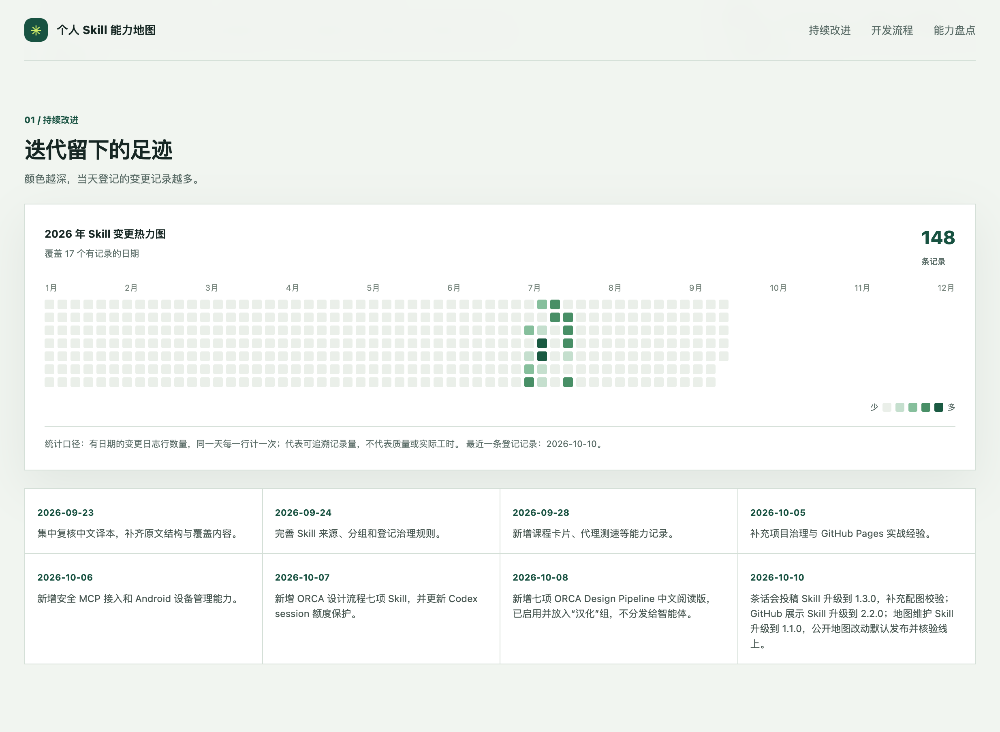
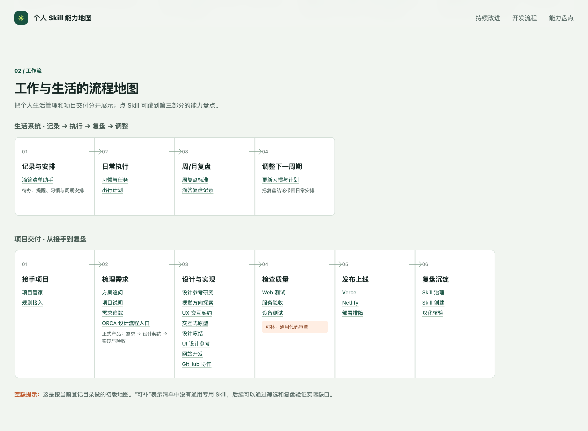
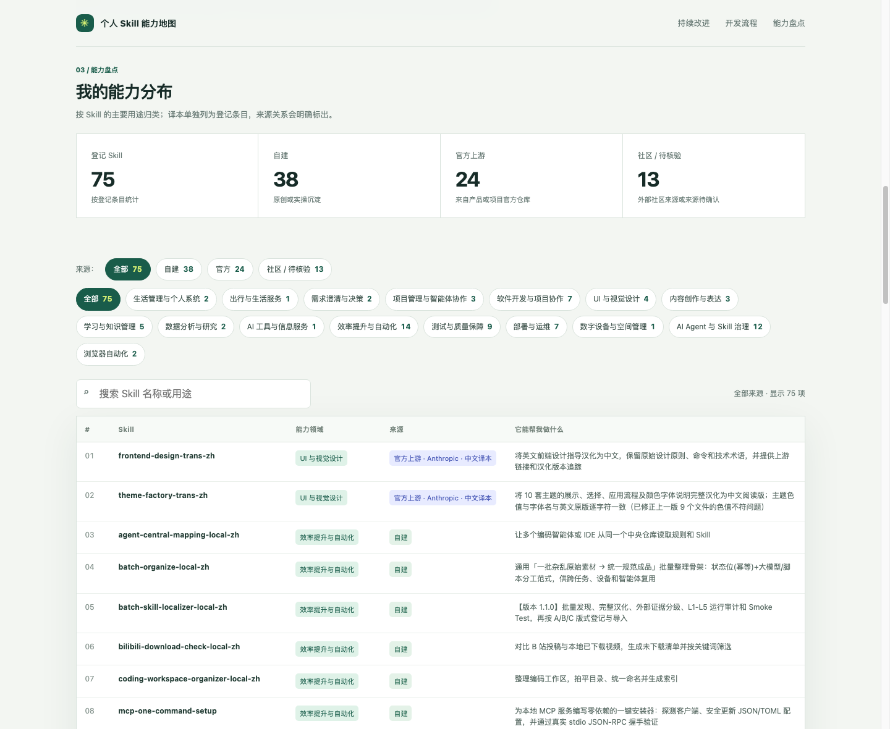

简体中文 | [English](./README.en.md)

# Skill 能力地图（ALW-002）

把工作、学习和生活中的方法整理成可复用的 Skill，直观看到能力分布、来源和流程之间的联系。

**在线浏览：**[打开 Skill 能力地图](https://wanghoufan.github.io/alw-002-skill-system-map/)

## 地图里有什么

| 区域 | 展示内容 |
| --- | --- |
| 持续改进 | 按日期汇总 Skill 登记变更的热力图和近期更新记录 |
| 工作与生活的流程地图 | 展示生活管理、项目交付等环节如何衔接，以及各环节对应的 Skill |
| 能力盘点 | 按能力领域浏览 Skill；可按自建、官方或社区 / 待核验来源筛选，也可搜索名称和用途 |

能力领域覆盖生活管理、出行服务、需求澄清、项目协作、UI 设计、内容创作、学习与知识管理、数据分析、效率自动化、测试、部署运维和 Skill 治理等方面。完整分类与数量可在在线地图中查看。

## 当前公开数据

公开页面的数据快照截至 **2026-10-06**，共登记 75 个 Skill。翻译版与英文原版作为独立条目展示；社区作品和来源尚未确认的条目归入“社区 / 待核验”。

| 来源 | 数量 | 说明 |
| --- | ---: | --- |
| 自建 | 38 | 原创或实操经验沉淀 |
| 官方上游 | 24 | 来自产品或项目的官方仓库 |
| 社区 / 待核验 | 13 | 外部社区作品或来源尚未确认 |

统计合并中央 `SKILL-REGISTRY.md` 与个人 Skill Manager 已安装清单，并按 Skill 名称去重。插件自带 Skill、ORCA 角色流程和项目专用规范不计入 Skill 总数；迭代热力图统计中央登记档案中的变更记录，不代表质量或投入时长。

## 快速开始

打开上方在线页面即可浏览，无需安装或启动本地服务。点击流程中的 Skill 可以跳到能力清单；使用来源筛选、领域筛选和搜索框快速定位条目。

## 项目文件

- `index.html`：地图页面
- `assets/skills.json`：公开 Skill 清单与分类
- `assets/iterations.json`：用于迭代热力图的变更记录
- `assets/screenshots/`：README 展示的页面截图
