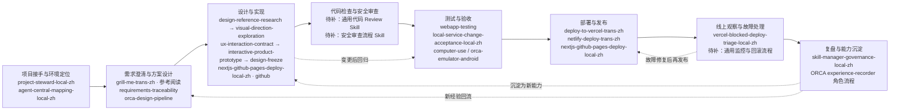

# Skill 体系地图（示意稿）

> 数据基准：中央 Skill 登记档案 + 当前个人技能库已安装清单，截至 2026-10-10。中央登记 73 项、Skill Manager 清单 90 项，按名称去重合计 93 项：中央独有 3 项、Skill Manager 独有 20 项。滴答清单助手与周复盘标准属于 Skill Manager 个人条目。

## Skill 能力领域总表

**登记总数：93 项。** 统计中央 Skill 登记档案（73 项）与当前 Skill Manager 清单（90 项），按名称去重后共 93 项；其中 3 项仅在中央登记，20 项仅在 Skill Manager 清单。翻译版与英文原版分开计数。来源无法确认的条目统一归为“外部 / 待确认”。

| 能力领域 | 领域总数 | 自建 Skill | 官方 Skill | 外部 / 待确认 Skill |
|---|---:|---|---|---|
| 生活管理与个人系统 | **2** | **2 项**<br>60. `dida-task-manager`<br>75. `weekly-review-standard` | **0 项**<br>— | **0 项**<br>— |
| 出行与生活服务 | **1** | **0 项**<br>— | **0 项**<br>— | **1 项**<br>74. `travel-cn` |
| 需求澄清与决策 | **2** | **1 项**<br>66. `leader` | **0 项**<br>— | **1 项**<br>62. `grill-me` |
| 项目管理与智能体协作 | **7** | **1 项**<br>16. `project-steward-local-zh` | **2 项**<br>18. `orchestration`<br>19. `orchestration-trans-zh` | **4 项**<br>84. `requirements-traceability`<br>85. `orca-design-pipeline`<br>91. `requirements-traceability-trans-zh`<br>92. `orca-design-pipeline-trans-zh` |
| 软件开发与项目协作 | **14** | **4 项**<br>14. `github-portfolio-sync-local-zh`<br>15. `github-readme-maintainer-local-zh`<br>17. `nextjs-github-pages-deploy-local-zh`<br>76. `github-homepage-showcase-local-zh` | **0 项**<br>— | **10 项**<br>20. `github`<br>21. `github-trans-zh`<br>22. `grill-me-trans-zh`<br>23. `ponytail-trans-zh`<br>81. `ux-interaction-contract`<br>82. `interactive-product-prototype`<br>83. `design-freeze`<br>88. `ux-interaction-contract-trans-zh`<br>89. `interactive-product-prototype-trans-zh`<br>90. `design-freeze-trans-zh` |
| UI 与视觉设计 | **8** | **0 项**<br>— | **4 项**<br>01. `frontend-design-trans-zh`<br>02. `theme-factory-trans-zh`<br>61. `frontend-design`<br>73. `theme-factory` | **4 项**<br>79. `design-reference-research`<br>80. `visual-direction-exploration`<br>86. `design-reference-research-trans-zh`<br>87. `visual-direction-exploration-trans-zh` |
| 内容创作与表达 | **3** | **2 项**<br>36. `ai-coding-homework-writeup-local-zh`<br>63. `guizang-ppt-skill` | **0 项**<br>— | **1 项**<br>65. `khazix-writer` |
| 学习与知识管理 | **5** | **3 项**<br>37. `course-md-organize-local-zh`<br>38. `course-pdf-to-md-local-zh`<br>39. `course-knowledge-card-local-zh` | **2 项**<br>41. `obsidian`<br>42. `obsidian-trans-zh` | **0 项**<br>— |
| 数据分析与研究 | **2** | **2 项**<br>40. `proxy-region-benchmark-local-zh`<br>64. `hv-analysis` | **0 项**<br>— | **0 项**<br>— |
| AI 工具与信息服务 | **1** | **0 项**<br>— | **0 项**<br>— | **1 项**<br>57. `aihot` |
| 效率提升与自动化 | **15** | **10 项**<br>03. `agent-central-mapping-local-zh`<br>04. `batch-organize-local-zh`<br>05. `batch-skill-localizer-local-zh`<br>06. `bilibili-download-check-local-zh`<br>07. `coding-workspace-organizer-local-zh`<br>08. `mcp-one-command-setup`<br>09. `mcp-one-command-setup-trans-zh`<br>56. `ai-quota-recovery-board`<br>68. `neat-freak`<br>78. `gpt-quota-fuse-local-zh` | **4 项**<br>10. `computer-use`<br>11. `computer-use-trans-zh`<br>12. `orca-cli`<br>13. `orca-cli-trans-zh` | **1 项**<br>70. `ponytail` |
| 测试与质量保障 | **9** | **5 项**<br>24. `local-service-change-acceptance-local-zh`<br>25. `android-device-target-lock-local-zh`<br>26. `android-moments-cleanup-local-zh`<br>27. `win-reveal-and-gui-selftest-local-zh`<br>58. `browser-e2e-login-pitfalls` | **4 项**<br>28. `webapp-testing`<br>29. `webapp-testing-trans-zh`<br>30. `orca-emulator-android`<br>31. `orca-emulator-android-trans-zh` | **0 项**<br>— |
| 部署与运维 | **7** | **3 项**<br>32. `vercel-blocked-deploy-triage-local-zh`<br>33. `chatgpt-secure-mcp-tunnel-local-zh`<br>55. `pgyer-apk-share-local-zh` | **4 项**<br>34. `deploy-to-vercel-trans-zh`<br>35. `netlify-deploy-trans-zh`<br>59. `deploy-to-vercel`<br>69. `netlify-deploy` | **0 项**<br>— |
| 数字设备与空间管理 | **1** | **1 项**<br>72. `storage-analyzer` | **0 项**<br>— | **0 项**<br>— |
| AI Agent 与 Skill 治理 | **13** | **7 项**<br>43. `central-skill-creator-mac-local-zh`<br>44. `central-skill-creator-pc-local-zh`<br>45. `project-skill-creator-mac-local-zh`<br>46. `project-skill-creator-pc-local-zh`<br>47. `skill-manager-governance-local-zh`<br>48. `skill-manager-agent-skill-audit-local-zh`<br>77. `skill-map-maintainer-local-zh` | **4 项**<br>49. `find-skills`<br>50. `find-skills-trans-zh`<br>51. `skill-creator-trans-zh`<br>71. `skill-creator` | **2 项**<br>52. `manage-skills-trans-zh`<br>67. `manage-skills` |
| 浏览器自动化 | **2** | **0 项**<br>— | **0 项**<br>— | **2 项**<br>53. `browseros-neo`<br>54. `browseros-neo-trans-zh` |

分类口径：同一名称只统计一次；中英文原版和 `-trans-zh` 阅读版分别登记。`自建`、`官方`和`外部 / 待确认`按当前清单中的互斥来源类型统计；插件 Skill、ORCA 角色流程和项目规范不计入登记总数。

## 开发工作流地图



ORCA Design Pipeline 七项分别覆盖参考研究、方向选择、UX 契约、交互原型、设计冻结、需求追踪和流程入口；适用于满足其前置条件的正式多屏产品。图中“待补”表示中央登记表暂时没有相应通用专用 Skill，并不表示完全没有相应实践或工具。带 `trans-zh` 的技能是中文阅读版；在执行链上应以中央登记的英文原版或实际可执行工具为准。后续正式地图应把执行型、阅读型和项目限定型节点用不同颜色或形状区分。

## 迭代展示建议

展示页建议同时放「年度迭代热力图」和「最近更新列表」。热力图按天统计实际记录的 Skill 变化事件，颜色越深代表当天迭代越多；点击某一天后，显示当天改了哪些 Skill、版本变化、修改类型和验证状态。

```text
迭代热力图（示意；每格代表一天，颜色代表当天事件数）
       周一 周二 周三 周四 周五 周六 周日
第 1 周   ·    ░    ·    ▒    ·    ·    ░
第 2 周   ▒    ░    ░    ·    ▓    ·    ·
第 3 周   ·    ·    ░    ▒    ░    ░    ·
第 4 周   ▓    ▒    ·    ░    ·    ░    ▒

图例：· 0 次  ░ 1 次  ▒ 2 次  ▓ 3 次及以上
```

正式页面可做成类似 GitHub contributions 的日历格：横轴按周、纵轴按星期；支持按年查看，并可筛选“新增 / 版本升级 / 内容优化 / 验证补充”。热力图只表示迭代活动量，不代表质量评分；验证状态应显示为独立标签，例如“已验证 / 部分验证 / 待验证”。

数据最好来自结构化变更记录，而不是仅凭文件修改时间推测。每条事件至少记录日期、Skill 名称、旧版与新版、变更类型、摘要、验证状态和来源提交。当前登记档案已有变更日志，但历史记录的粒度和日期格式不完全一致；正式上线前需要先统一事件格式，再由脚本自动汇总。近期登记中可见的节点包括：

| 日期 | Skill | 版本/事件 | 展示重点 |
|---|---|---|---|
| 2026-10-06 | github-readme-maintainer-local-zh | 1.8.0 | 仓库文档维护能力更新 |
| 2026-10-06 | chatgpt-secure-mcp-tunnel-local-zh | 1.0.0 | 新增跨设备 MCP 接入与维护流程 |
| 2026-10-06 | android-device-target-lock-local-zh | 1.0.0 | 新增跨项目设备目标锁定能力 |
| 2026-10-06 | nextjs-github-pages-deploy-local-zh | 1.2.0 导入登记 | 纳入双线部署实战经验 |
| 2026-10-07 | ORCA Design Pipeline V1.6 | 新增七项独立英文 Skill | 设计研究、方向探索、UX 契约、交互原型、设计冻结、需求追踪与流程入口 |
| 2026-10-08 | ORCA Design Pipeline V1.6 | 新增七项中文阅读版 | 对应 `-trans-zh` 条目加入“汉化”组，启用可见但不分发给智能体 |
| 2026-10-10 | github-homepage-showcase-local-zh | 2.2.0 | README 展示与发布流程更新 |
| 2026-10-10 | showcase-tea-submission-local-zh | 1.3.0 | 补充投稿配图校验 |
| 2026-10-10 | skill-map-maintainer-local-zh | 1.1.0 | 公开地图更新默认提交、推送、部署并核验线上页面 |

后续建议让登记档案成为唯一数据源，自动生成总数、分类计数、最近迭代和流程地图；页面再补充时间筛选、按领域筛选，以及点击节点查看对应 Skill 说明的入口。这样新增 Skill 或版本变化时，展示页能同步更新，避免手工统计过期。
