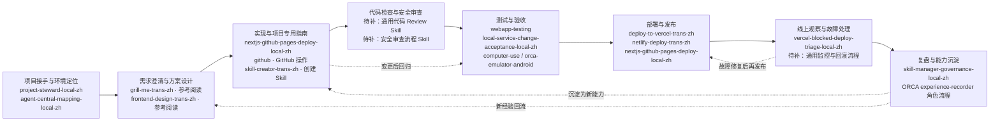

# Skill 体系地图（示意稿）

> 数据基准：中央仓库 `SKILL-REGISTRY.md`，截至 2026-10-06。当前正式登记 54 个 Skill。磁盘扫描发现的 56 份 `SKILL.md` 中，另有仓库根入口副本和一个历史快照，不重复计入；2 个非用户级 Skill 仍计入中央资产总数，并在正式展示页中单独标明。

## Skill 能力领域总表

**登记总数：54 项。** 每个条目按主要用途归入一个领域；单元格内以序号和名称逐项展示。官方栏只收录登记来源指向对应项目官方组织的条目，社区来源和待核验来源单独列出。

| 能力领域 | 领域总数 | 自建 Skill | 官方 Skill | 外部 / 待确认 Skill |
|---|---:|---|---|---|
| UI 与视觉设计 | **2** | **0 项**<br>— | **2 项**<br>01. `frontend-design-trans-zh`<br>02. `theme-factory-trans-zh` | **0 项**<br>— |
| 效率提升与自动化 | **11** | **7 项**<br>03. `agent-central-mapping-local-zh`<br>04. `batch-organize-local-zh`<br>05. `batch-skill-localizer-local-zh`<br>06. `bilibili-download-check-local-zh`<br>07. `coding-workspace-organizer-local-zh`<br>08. `mcp-one-command-setup`<br>09. `mcp-one-command-setup-trans-zh` | **4 项**<br>10. `computer-use`<br>11. `computer-use-trans-zh`<br>12. `orca-cli`<br>13. `orca-cli-trans-zh` | **0 项**<br>— |
| 软件开发与项目协作 | **10** | **4 项**<br>14. `github-portfolio-sync-local-zh`<br>15. `github-readme-maintainer-local-zh`<br>21. `project-steward-local-zh`<br>22. `nextjs-github-pages-deploy-local-zh` | **2 项**<br>19. `orchestration`<br>20. `orchestration-trans-zh` | **4 项**<br>16. `github`<br>17. `github-trans-zh`<br>18. `grill-me-trans-zh`<br>23. `ponytail-trans-zh` |
| 测试与质量保障 | **8** | **4 项**<br>24. `local-service-change-acceptance-local-zh`<br>25. `android-device-target-lock-local-zh`<br>26. `android-moments-cleanup-local-zh`<br>27. `win-reveal-and-gui-selftest-local-zh` | **4 项**<br>28. `webapp-testing`<br>29. `webapp-testing-trans-zh`<br>30. `orca-emulator-android`<br>31. `orca-emulator-android-trans-zh` | **0 项**<br>— |
| 部署与运维 | **4** | **2 项**<br>34. `vercel-blocked-deploy-triage-local-zh`<br>35. `chatgpt-secure-mcp-tunnel-local-zh` | **2 项**<br>32. `deploy-to-vercel-trans-zh`<br>33. `netlify-deploy-trans-zh` | — |
| 内容整理与知识管理 | **7** | **5 项**<br>36. `ai-coding-homework-writeup-local-zh`<br>37. `course-md-organize-local-zh`<br>38. `course-pdf-to-md-local-zh`<br>39. `course-knowledge-card-local-zh`<br>42. `proxy-region-benchmark-local-zh` | **2 项**<br>40. `obsidian`<br>41. `obsidian-trans-zh` | **0 项**<br>— |
| Skill 创建与治理 | **10** | **6 项**<br>43. `central-skill-creator-mac-local-zh`<br>44. `central-skill-creator-pc-local-zh`<br>45. `project-skill-creator-mac-local-zh`<br>46. `project-skill-creator-pc-local-zh`<br>47. `skill-manager-governance-local-zh`<br>48. `skill-manager-agent-skill-audit-local-zh` | **3 项**<br>49. `find-skills`<br>50. `find-skills-trans-zh`<br>52. `skill-creator-trans-zh` | **1 项**<br>51. `manage-skills-trans-zh` |
| 浏览器自动化 | **2** | **0 项**<br>— | **0 项**<br>— | **2 项**<br>53. `browseros-neo`<br>54. `browseros-neo-trans-zh` |

分类口径：总数按登记条目计算，译本也作为单独 Skill 展示；每个 Skill 只计入一个主要能力领域。自建表示本地原创或基于用户实操沉淀；官方表示登记来源指向已核实的对应项目/厂商官方仓库（包括 Netlify 官方仓库）；外部/待确认包括社区作者作品和来源信息不足的条目。详细用途可在后续页面的 Skill 详情中展示。

## 开发工作流地图



图中“待补”表示中央登记表暂时没有面向通用开发流程的专用 Skill，并不表示完全没有相应实践或工具。带 `trans-zh` 的技能是中文阅读版；在执行链上应以中央登记的英文原版或实际可执行工具为准。后续正式地图应把执行型、阅读型和项目限定型节点用不同颜色或形状区分。

## 迭代展示建议

展示页建议同时放「年度迭代热力图」和「最近更新列表」。热力图按天统计实际记录的 Skill 变化事件，颜色越深代表当天迭代越多；点击某一天后，显示当天改了哪些 Skill、版本变化、修改类型和验证状态。

```text
迭代热力图（示意；每格代表一天，颜色代表当天事件数）
       周一 周二 周三 周四 周五 周六 周日
第 1 周   ·    ░    ·    ▒    ·    ·    ░
第 2 周   ▒    ░    ░    ·    ▓    ·    ·
第 3 周   ·    ·    ░    ▒    ░    ░    ·
第 4 周   ▓    ▒    ·    ░    ·    ░    ▒

图例：· 0 次  ░ 1 次  ▒ 2 次  ▓ 3 次及以上
```

正式页面可做成类似 GitHub contributions 的日历格：横轴按周、纵轴按星期；支持按年查看，并可筛选“新增 / 版本升级 / 内容优化 / 验证补充”。热力图只表示迭代活动量，不代表质量评分；验证状态应显示为独立标签，例如“已验证 / 部分验证 / 待验证”。

数据最好来自结构化变更记录，而不是仅凭文件修改时间推测。每条事件至少记录日期、Skill 名称、旧版与新版、变更类型、摘要、验证状态和来源提交。当前登记档案已有变更日志，但历史记录的粒度和日期格式不完全一致；正式上线前需要先统一事件格式，再由脚本自动汇总。近期登记中可见的节点包括：

| 日期 | Skill | 版本/事件 | 展示重点 |
|---|---|---|---|
| 2026-10-06 | github-readme-maintainer-local-zh | 1.8.0 | 仓库文档维护能力更新 |
| 2026-10-06 | chatgpt-secure-mcp-tunnel-local-zh | 1.0.0 | 新增跨设备 MCP 接入与维护流程 |
| 2026-10-06 | android-device-target-lock-local-zh | 1.0.0 | 新增跨项目设备目标锁定能力 |
| 2026-10-06 | nextjs-github-pages-deploy-local-zh | 1.2.0 导入登记 | 纳入双线部署实战经验 |

后续建议让登记档案成为唯一数据源，自动生成总数、分类计数、最近迭代和流程地图；页面再补充时间筛选、按领域筛选，以及点击节点查看对应 Skill 说明的入口。这样新增 Skill 或版本变化时，展示页能同步更新，避免手工统计过期。
